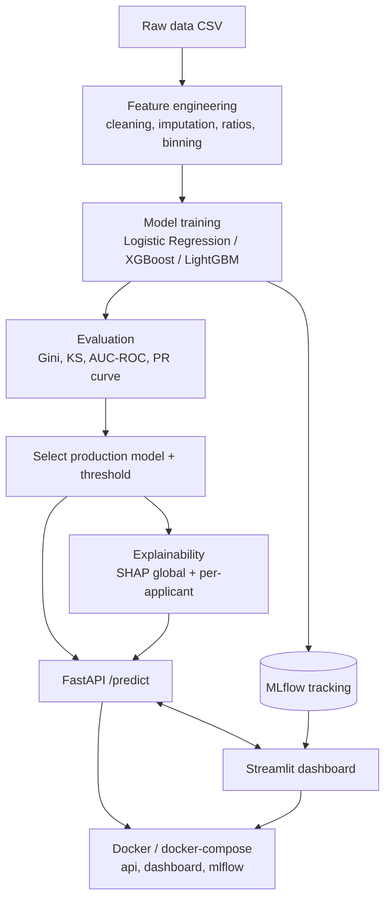
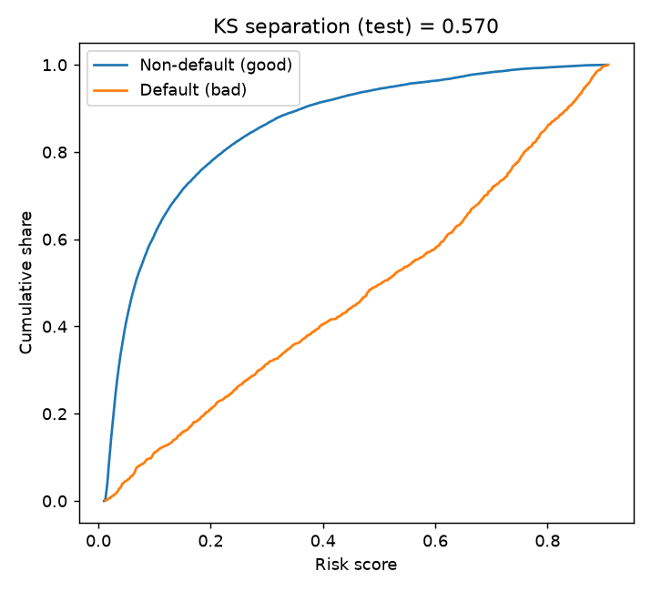
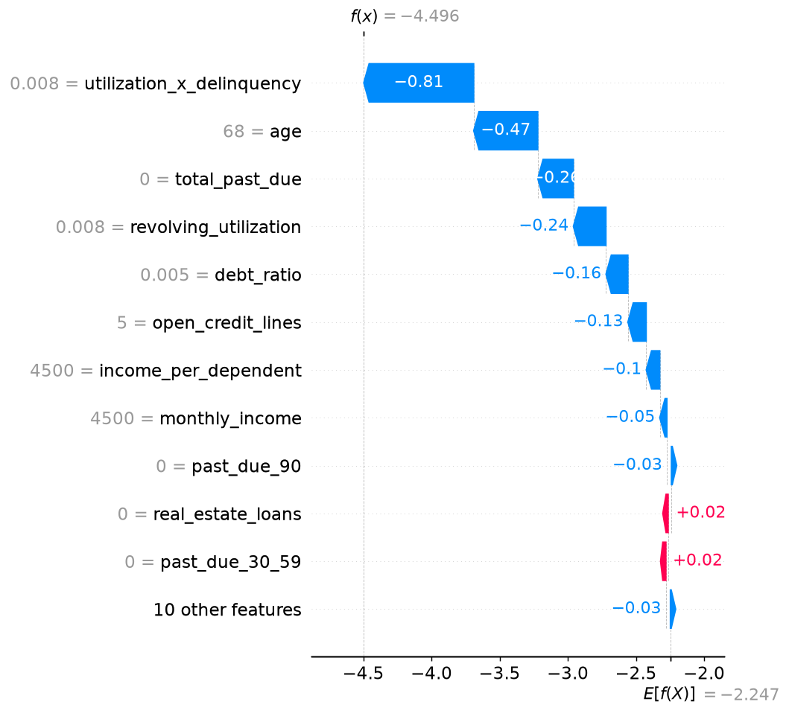
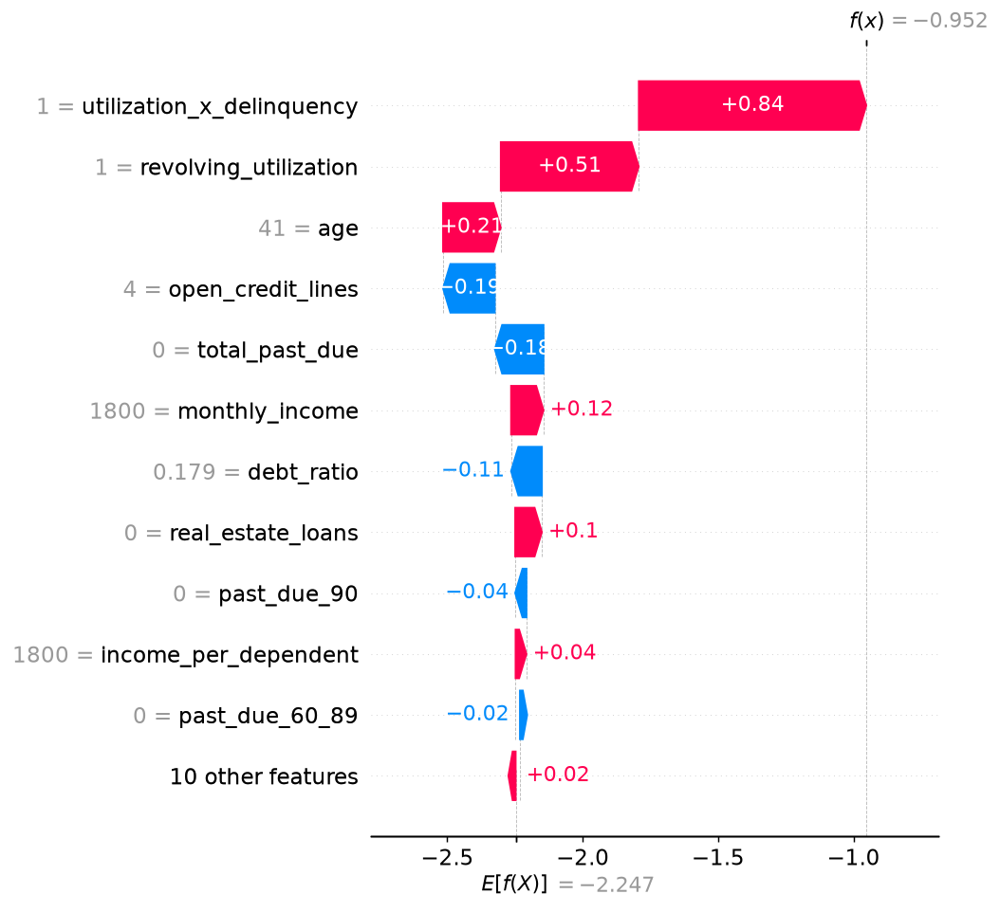
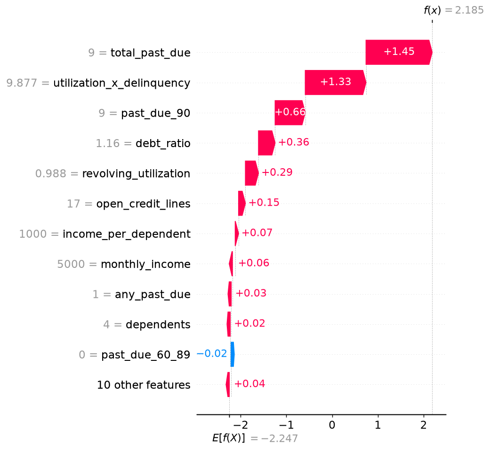

<div align="center">

# Fintech Credit Risk Scoring

**Predict who is likely to default, explain why, and serve it through an API.**

End-to-end ML pipeline · Explainable scoring API · Analyst dashboard

<br>


<br>

<!-- TODO: add docs/images/dashboard_demo.gif (10 sec screen recording of the Applicant explorer) -->


<br>

| Gini | KS | AUC-ROC | Latency (p95) |
|:---:|:---:|:---:|:---:|
| **–** | **–** | **–** | **– ms** |

<sub>Test-set numbers for the selected model.</sub>

</div>

---

A machine learning system that predicts the probability a consumer will experience serious financial distress (90+ days delinquent) within two years. It mirrors how fintech risk teams work: multiple model families compared under tracked experiments, credit-industry metrics (Gini, KS), a cost-aware decision threshold, and per-applicant SHAP explanations served alongside every score.

## Table of Contents

1. [Business Problem](#1-business-problem)
2. [Key Features](#2-key-features)
3. [Architecture](#3-architecture)
4. [Dataset](#4-dataset)
5. [Feature Engineering](#5-feature-engineering)
6. [Modeling & Experiment Tracking](#6-modeling--experiment-tracking)
7. [Results](#7-results)
8. [Threshold Selection](#8-threshold-selection)
9. [Explainability (SHAP)](#9-explainability-shap)
10. [API Reference](#10-api-reference)
11. [Dashboard](#11-dashboard)
12. [Getting Started](#12-getting-started)
13. [Project Structure](#13-project-structure)
14. [Testing](#14-testing)
15. [Limitations & Future Work](#15-limitations--future-work)
16. [Acknowledgements](#16-acknowledgements)

---

## 1. Business Problem

Lenders must decide who gets credit and on what terms. Two errors matter:

| Error | What happens | Cost |
|---|---|---|
| **False negative** | Approve someone who later defaults | Lost principal |
| **False positive** | Decline someone who would have repaid | Lost interest and a lost customer |

These costs are asymmetric, so a default 0.5 probability cutoff is rarely the right decision rule. Regulators and internal model-risk teams also require that individual decisions be **explainable**. This project handles both: it picks the operating threshold from an explicit cost trade-off and ships a SHAP explanation with every prediction.

## 2. Key Features

- **Multi-model comparison** – Logistic Regression (interpretable baseline), XGBoost and LightGBM, with hyperparameter search.
- **Experiment tracking** – every run logs parameters, metrics, training time and model artifacts to MLflow.
- **Credit-industry metrics** – Gini coefficient, KS statistic and AUC-ROC, plus precision-recall analysis.
- **Cost-aware threshold** – the decision cutoff is a documented design choice, not the default 0.5.
- **Per-applicant explainability** – SHAP values and force/waterfall plots for individual decisions.
- **Production-style serving** – FastAPI `/predict` endpoint with Pydantic input validation, returning score, decision and explanation.
- **Analyst dashboard** – model comparison, global feature importance and an interactive what-if explanation view.
- **Reproducible deployment** – Docker and docker-compose bring the whole stack up with one command.

## 3. Architecture



**Two phases**

- *Offline (training):* data → features → train → evaluate → register best model.
- *Online (serving):* the API loads the model, preprocessor and SHAP explainer once at startup and scores requests in real time. The dashboard calls the API and reads MLflow; it never retrains.

The preprocessing pipeline is saved together with the model, so training and serving apply identical transformations (no train/serve skew).

## 4. Dataset

**Give Me Some Credit** (Kaggle, 2011 competition).

| Item | Detail |
|---|---|
| Rows (labelled) | ~150,000 (`cs-training.csv`) |
| Target | `SeriousDlqin2yrs` – 1 if the person experienced 90+ days past due delinquency within two years |
| Class balance | ~6.7% defaults (moderate imbalance) |
| Features | 10 numeric borrower attributes (utilization, age, delinquency history, debt ratio, income, credit lines, dependents, etc.) |

`cs-test.csv` has no labels (it was used for the original leaderboard), so this project builds its own **stratified 70 / 15 / 15 train / validation / test split** from `cs-training.csv`, preserving the default rate in each split.

Download the data from Kaggle and place the files in `data/raw/`:
[kaggle.com/c/GiveMeSomeCredit](https://www.kaggle.com/c/GiveMeSomeCredit)

<details>
<summary><b>Original columns</b></summary>

<br>

| Column | Description |
|---|---|
| `SeriousDlqin2yrs` | Target: 90+ days delinquent within 2 years |
| `RevolvingUtilizationOfUnsecuredLines` | Balance on cards/credit lines divided by credit limits |
| `age` | Borrower age |
| `NumberOfTime30-59DaysPastDueNotWorse` | Times 30–59 days late |
| `DebtRatio` | Monthly debt payments / monthly gross income |
| `MonthlyIncome` | Monthly income |
| `NumberOfOpenCreditLinesAndLoans` | Open loans and credit lines |
| `NumberOfTimes90DaysLate` | Times 90+ days late |
| `NumberRealEstateLoansOrLines` | Mortgage and real-estate loans |
| `NumberOfTime60-89DaysPastDueNotWorse` | Times 60–89 days late |
| `NumberOfDependents` | Number of dependents |

</details>

<!-- TODO: optional EDA image. Save target distribution / missing values chart as docs/images/eda_overview.png -->
<div align="center">

</div>

## 5. Feature Engineering

Every transformation is documented with its rationale.

| Step | Treatment | Rationale |
|---|---|---|
| Missing `MonthlyIncome` (~20%) | Median imputation (fit on train only) + `income_missing` flag | Missingness can itself carry risk signal; flag preserves it |
| Missing `NumberOfDependents` (~2.6%) | Median/zero imputation + flag | Small share; keeps rows |
| Implausible `age` | Clip to a valid adult range | Remove data-entry errors |
| Sentinel past-due codes (96, 98) | Cap / flag | These are placeholder codes, not real counts |
| Extreme utilization and debt ratio | Cap at 99th percentile of train | Limits outlier influence, especially for linear models |
| Derived ratios | Debt-to-income, income per dependent, total past-due count, utilization bands | Encode domain knowledge risk analysts already use |
| Age bands | Binned age groups | Improves stability and interpretability |

<!-- TODO: add a short table of the final engineered feature list once src/features/build_features.py is complete -->

All fitting (imputers, caps, scalers) uses the **training split only** to prevent leakage.

## 6. Modeling & Experiment Tracking

| Model | Role | Imbalance handling |
|---|---|---|
| Logistic Regression (L2) | Interpretable baseline | `class_weight="balanced"` |
| XGBoost | Gradient-boosted trees | `scale_pos_weight` |
| LightGBM | Gradient-boosted trees | `is_unbalance` / `scale_pos_weight` |

- Hyperparameters tuned with Optuna (or grid search) on the validation set.
- 4+ MLflow runs compared side by side (AUC, Gini, KS, training time).
- The final model is selected on validation metrics and evaluated **once** on the held-out test set.

<!-- TODO: add docs/images/mlflow_runs.png (screenshot of the MLflow runs comparison table) -->
<div align="center">

<br>
<sub>MLflow runs compared side by side.</sub>
</div>

<br>

Launch the MLflow UI:

```bash
mlflow ui --backend-store-uri ./mlruns
# open http://localhost:5000
```

## 7. Results

<!-- TODO: fill these in after training. Report test-set numbers for the selected model and validation numbers for the comparison. -->

| Model | AUC-ROC | Gini | KS | Train time (s) |
|---|---|---|---|---|
| Logistic Regression | – | – | – | – |
| XGBoost | – | – | – | – |
| LightGBM | – | – | – | – |
| **Selected model (test set)** | – | – | – | – |

Inference latency (p50 / p95): – ms / – ms

<!-- TODO: add docs/images/model_comparison.png, roc_curves.png, ks_plot.png -->
<div align="center">


<br>

</div>

**Metric definitions**

- **Gini** = 2 × AUC − 1. Rank-ordering power; the standard in credit scoring.
- **KS** = maximum separation between the cumulative score distributions of defaulters and non-defaulters.
- **AUC-ROC** = probability a random defaulter is scored higher than a random non-defaulter.

## 8. Threshold Selection

The operating threshold is chosen from the precision-recall curve using an explicit cost ratio between a missed default and a wrongly declined applicant.

| Item | Value |
|---|---|
| Assumed cost ratio (FN : FP) | – : 1 |
| Selected threshold | – |
| Precision at threshold | – |
| Recall at threshold | – |
| Approval rate | – |

<!-- TODO: add docs/images/pr_curve_threshold.png (PR curve with the chosen threshold marked) -->
<div align="center">

</div>

<!-- TODO: write the reasoning here: why this cost ratio, what the threshold trades away, and how the choice would change under a different risk appetite. -->

## 9. Explainability (SHAP)

- **Global:** SHAP summary plot ranks the features driving predicted risk across the portfolio.
- **Local:** force/waterfall plots explain single decisions. Three example applicants are documented: one clearly approved, one clearly declined, one borderline.

<!-- TODO: add docs/images/shap_global.png -->
<div align="center">

<br>
<sub>Global feature importance.</sub>
</div>

<br>

| Approved | Borderline | Declined |
|:---:|:---:|:---:|
|  |  |  |

## 10. API Reference

Base URL (local): `http://localhost:8000`. Interactive docs: `http://localhost:8000/docs`.

| Method | Endpoint | Description |
|---|---|---|
| `POST` | `/predict` | Score one applicant and return an explanation |
| `GET` | `/health` | Liveness check |
| `GET` | `/model-info` | Model version, threshold and metrics |

<!-- TODO: optional, add docs/images/api_docs.png (screenshot of the /docs Swagger page) -->
<div align="center">

</div>

### `POST /predict`

Request:

```json
{
  "revolving_utilization": 0.35,
  "age": 42,
  "past_due_30_59": 0,
  "debt_ratio": 0.42,
  "monthly_income": 5400,
  "open_credit_lines": 8,
  "past_due_90": 0,
  "real_estate_loans": 1,
  "past_due_60_89": 0,
  "dependents": 2
}
```

Response:

```json
{
  "risk_score": 0.087,
  "decision": "approve",
  "threshold": 0.21,
  "shap_explanation": {
    "base_value": 0.067,
    "top_factors": [
      {"feature": "revolving_utilization", "value": 0.35, "shap": -0.021},
      {"feature": "past_due_90", "value": 0, "shap": -0.018}
    ]
  },
  "model_version": "lgbm_v1"
}
```

Example call:

```bash
curl -X POST http://localhost:8000/predict \
  -H "Content-Type: application/json" \
  -d @sample_request.json
```

Inputs are validated with Pydantic; out-of-range or missing fields return HTTP `422` with a descriptive error.

## 11. Dashboard

Streamlit app at `http://localhost:8501` with three views:

1. **Model comparison** – table and charts pulled from MLflow.
2. **Global explainability** – SHAP feature importance.
3. **Applicant explorer** – enter applicant details, call the API, and see the score, decision and SHAP waterfall.

<!-- TODO: add one screenshot per view -->
<div align="center">

<br><br>

</div>

## 12. Getting Started

### Prerequisites

- Python 3.10+
- Docker and docker-compose (for the containerized stack)
- Kaggle "Give Me Some Credit" data in `data/raw/`

### Run everything with Docker

```bash
git clone https://github.com/ananyanair12/Fintech_Credit_Risk_Scoring.git
cd Fintech_Credit_Risk_Scoring
docker-compose up --build
```

| Service | URL |
|---|---|
| API | http://localhost:8000 |
| Dashboard | http://localhost:8501 |
| MLflow | http://localhost:5000 |

### Local setup (without Docker)

```bash
git clone https://github.com/ananyanair12/Fintech_Credit_Risk_Scoring.git
cd Fintech_Credit_Risk_Scoring

python -m venv .venv
source .venv/bin/activate          # Windows: .venv\Scripts\activate
pip install -r requirements.txt
```

Run the pipeline:

```bash
python -m src.data.split           # create train/val/test splits
python -m src.models.train         # train all models, log to MLflow
python -m src.models.evaluate      # metrics, threshold analysis
python -m src.explain.shap_utils   # SHAP artifacts
```

Run the services:

```bash
# API
uvicorn api.main:app --reload --port 8000

# Dashboard (separate terminal)
streamlit run dashboard/app.py
```

## 13. Project Structure

```
Fintech_Credit_Risk_Scoring/
├── data/
│   ├── raw/                  # Kaggle files (gitignored)
│   └── processed/            # train/val/test parquet (gitignored)
├── docs/
│   └── images/               # README images and GIFs
├── notebooks/
│   ├── 01_eda.ipynb
│   └── 02_feature_experiments.ipynb
├── src/
│   ├── config.py
│   ├── data/                 # split.py
│   ├── features/             # build_features.py
│   ├── models/               # train.py, tune.py, evaluate.py
│   └── explain/              # shap_utils.py
├── api/                      # FastAPI app, schemas, predictor, Dockerfile
├── dashboard/                # Streamlit app, Dockerfile
├── tests/
├── artifacts/                # saved model, preprocessor (gitignored)
├── docker-compose.yml
├── requirements.txt
└── README.md
```

## 14. Testing

```bash
pytest tests/
```

Covers feature-engineering functions, API schema validation, and a smoke test on `/predict`.

## 15. Limitations & Future Work

- Data is from 2011 and lacks categorical and behavioral features; results are illustrative rather than production-grade.
- No fairness or bias audit yet (e.g., performance across age bands).
- Score calibration (Platt / isotonic) and conversion to a scorecard (points-based) are natural next steps.
- Add drift monitoring (PSI) and automated retraining.
- Try the richer Home Credit Default Risk dataset with bureau and previous-application tables.
- Deploy the API to a free-tier host (Render, Railway or Fly.io) for a public demo endpoint.

## 16. Acknowledgements

- Dataset: *Give Me Some Credit*, Kaggle competition (2011).
- Libraries: scikit-learn, XGBoost, LightGBM, SHAP, MLflow, FastAPI, Streamlit.

## License

Released under the MIT License. Add a `LICENSE` file to the repo root.